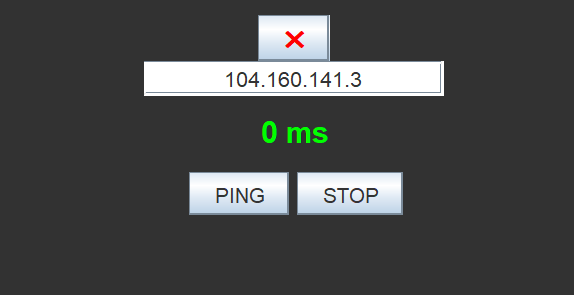

# 📡 PingApp-Java-Fixed

Ce projet est une **version corrigée, refactorée et améliorée** d'une petite application Java nommé **PingTest 2.0** trouvée sur GitHub, qui mesurait le ping vers un serveur donné et l’affichait via une surcouche graphique simple.

## 🙏 Crédit original

Projet initialement développé par [Necroliner](https://github.com/Necroliner) : [lien vers le repo original](https://github.com/Necroliner/PingTest.git).
Nom original du fichier : `PingTest 2.0` (Java)
Code publié initialement sans licence – utilisation dans un but pédagogique et d’apprentissage.

## 🎯 Objectif du projet

L’objectif était initialement de créer une interface graphique minimaliste affichant en direct le **ping vers une IP spécifique**.

Cependant, le code original souffrait de plusieurs problèmes :
- UI figée et peu interactive
- Gestion des threads hasardeuse (Timer vs Swing)
- Pas de contrôle utilisateur (impossible de changer l’IP)
- Code peu structuré / difficile à maintenir

## 🔧 Améliorations apportées

| Élément                  | Avant                                           | Après                                                        |
|--------------------------|--------------------------------------------------|---------------------------------------------------------------|
| **Threading**            | `TimerTask` bloquant                            | `ScheduledExecutorService` pour un threading propre           |
| **Initialisation UI**    | Interface auto-lancée sans contrôle             | Lancement explicite, meilleure séparation des responsabilités |
| **Contrôle IP**          | IP fixe codée en dur                            | Champ utilisateur pour modifier dynamiquement l’adresse       |
| **Boutons de contrôle**  | Aucun                                           | Ajout des boutons PING / STOP / QUITTER                       |
| **Couleurs du ping**     | Codées pour secondes (!), peu lisibles          | Conversion correcte + codes couleur bien calibrés             |
| **Code structuré**       | 1 seul gros bloc, pas de gestion d’erreurs      | Séparation claire, gestion propre des exceptions              |
| **Shutdown propre**      | Aucun hook / fuite mémoire potentielle          | Hook d’arrêt + reset du scheduler                             |

## 📷 Aperçu

### 🎛️ Interface graphique



### 🖥️ Affichage terminal


---

## 🚀 Lancer le projet

### 🧰 Prérequis

- **Java SDK / JRE** : Java **1.8** (JavaSE-1.8)
  - Compiler compliance level : `1.8`
  - JRE System Library : `JavaSE-1.8`
- **IDE recommandé** : Eclipse IDE for Java Developers
  - Version testée : *2022-06 (4.24.0)*
  - Build ID : *20220609-1112*
- **Bibliothèques utilisées** :
  - `java.time.*` pour la gestion du temps (Java 8+)
  - `java.awt.*` & `javax.swing.*` pour l’interface graphique (Swing natif)
  - `java.net.*` pour le ping réseau
  - `java.util.concurrent.*` pour la gestion de threads et du scheduler

⚠️ À noter : l’utilisation de **Swing** nécessite de vérifier l’environnement de développement et d’exécution. Swing est pleinement compatible avec **Java 8 (JavaSE-1.8)**, mais peut présenter des problèmes avec des versions plus récentes du JDK (Java 11+)

### 🚀 Méthode 1 : Via Eclipse (ou autre IDE)

1. Ouvrir le dossier du projet dans Eclipse
2. Vérifier que le SDK Java est bien configuré (Java Build Path)
3. Lancer la classe `Principale.java` (clic droit > Run as → Java Application)

---

### ⚙️ Méthode 2 : En ligne de commande

```bash
javac Principale.java Overlay.java
java Principale
```bash

⚠️ Attention : le JRE utilisé en ligne de commande (via `java`) peut être différent de celui configuré dans Eclipse.
Vérifiez que votre `JAVA_HOME` et votre `PATH` pointent bien vers le même JDK/JRE que celui utilisé en IDE, sinon vous pourriez avoir des différences entre IDE & CLI.
---

## 🧠 Ce que j'ai appris

- Bonnes pratiques en gestion de threads Java
- Intégration de composants Swing réactifs
- UI minimaliste mais interactive
- Nettoyage et refonte de code existant : refactor responsable

---
